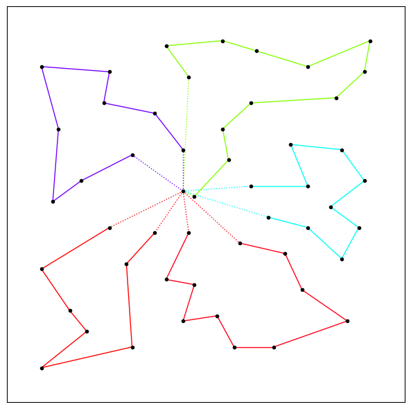

# CVRP Two Index Vehicle Flow Formulation <br><sub> Branch-and-cut example using CPLEX with CVRPSEP </sub>



This repo implements in C++ the two index vehicle flow formulation[2] and the solution using the branch-and-cut (BC) method.
BC is implemented using CVRPSEP[1] through a CPLEX generic callback.

The program can read all classical CVRP instances, that can be found in http://vrp.atd-lab.inf.puc-rio.br/index.php/en/. 
Moreover, a python file (`print_result.py`) is provided to print the output routes if the solution is found.

If the user wants to use a legacy LazyConstraintCallback it can be found in `Cvrpsep_callback.h`. Then 

> [!IMPORTANT]
> This is just an example to start working with CPLEX, using generic and legacy callbacks.  
## Requirements
- CMAKE
- CPLEX $`\geq`$ 12.10
- format library : https://github.com/fmtlib/fmt. If you are using windows you can use format from standard library with small changes;
- RapidJSON library : https://rapidjson.org/;
- Boost program_options : https://www.boost.org/doc/libs/1_63_0/doc/html/program_options.html;
- (Optional) Python with numpy, matplotlib and networkX ;

## Input Example
| Arg | Comment                                                 |
|-----|---------------------------------------------------------|
| -i  | Path to the instance (`*.vrp`)                          |
| -c  | Config json file (see the example in the folder config) |

## Output
The output folder is given in the build location. These files are useful for checking the input model given to CPLEX and 
for printing the output graph using the Python file provided.

| File              | Comment                                                                           |
|-------------------|-----------------------------------------------------------------------------------|
| coords.txt        | Coordinates of the costumers with a third value representing the demand           |
| distances.txt     | Distance matrix of the nodes                                                      |
| model.lp          | Input model for cplex (in order to verify if the written constraints are correct) |
| solutionEdges.txt | Edges of the solution graph                                                       |


## Citation
```
@article{article,
author = {Lysgaard, Jens},
year = {2003},
month = {01},
pages = {},
title = {CVRPSEP: A package of separation routines for the Capacitated Vehicle Routing Problem}
},
@book{toth2014vehicle,
  title={Vehicle routing: problems, methods, and applications},
  author={Toth, Paolo and Vigo, Daniele},
  year={2014},
  publisher={SIAM}
}
```


